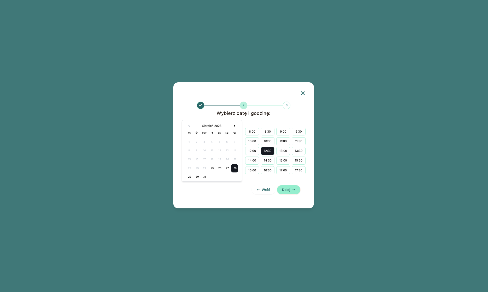
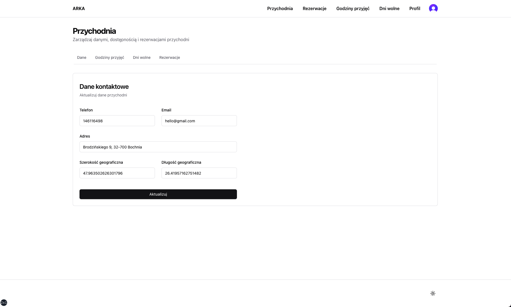
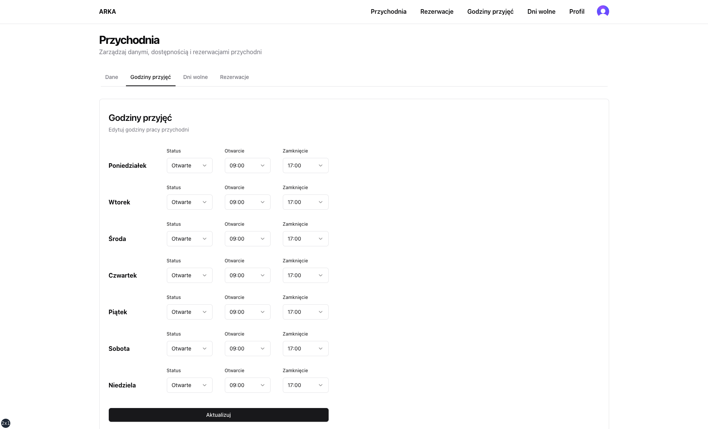
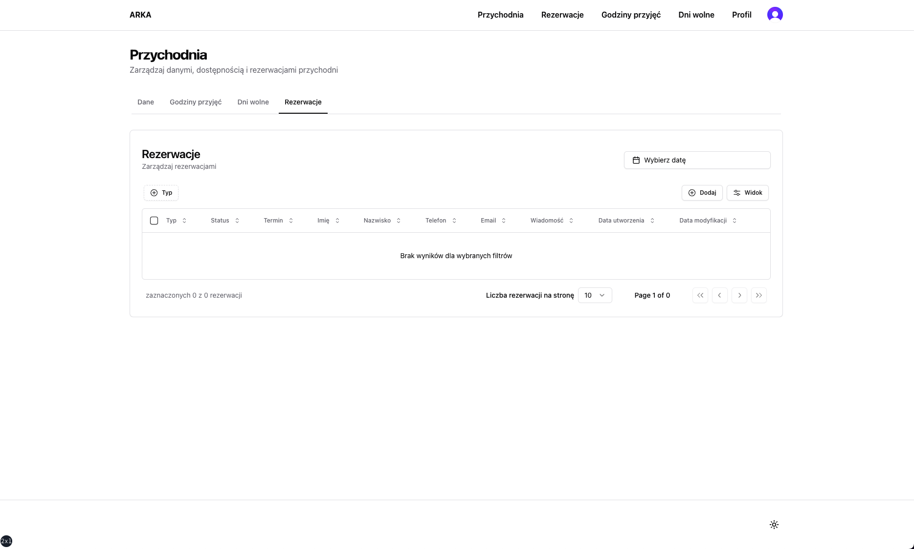

<div id="readme-top">
  <h1 align="center">ARKA</h1>
  <h3 align="center">Veterinary Clinic Landing Page and Appointment Booking System</h3>
  <p align="center">
    <a href="https://github.com/pjborowiecki/ARKA-Veterinary-Clinic-Page-and-Appointment-Booking-System.git/issues">Report Bug</a>
    ·
    <a href="https://github.com/pjborowiecki/ARKA-Veterinary-Clinic-Page-and-Appointment-Booking-System.git/issues">Request Feature</a>
  </p>
</div>

<!-- TABLE OF CONTENTS -->
<details>
  <summary>Table of Contents</summary>
  <ol>
    <li><a href="#about-the-project">About The Project</a></li>
    <li><a href="#tech-stack">Tech Stack</a></li>
    <li><a href="#features">Features</a></li>
    <li><a href="#getting-started">Getting Started</li>
    <li><a href="#contributing">Contributing</a></li>
    <li><a href="#license">License</a></li>
    <li><a href="#contact">Contact</a></li>
    <li><a href="#todo">ToDo</li>
  </ol>
</details>

## About the Project


<br>


<br>


<br>


<br>


<br>


<br>

This project is a re-build of a website I receintly build with [Remix](https://remix.run/) and [MongoDB Atlas](https://www.mongodb.com/atlas/database) for one of my clients in Poland. I decided to re-build it with the latest and greatest in tech for my own learning purposes.

The client wanted a simple website with a contact form and a full booking management system, where he would be able to confirm or reject bookings and notify the client via email. The website is hosted on Vercel. When completed, I intend to replace the original website with this rebuild.

**<u>This project is currently in development. Please check back soon.</u>**

<p align="right">(<a href="#readme-top">back to top</a>)</p>
<br>

## Tech Stack

- **Framework:** [Next.js 13](https://nextjs.org)
- **Styling:** [Tailwind CSS](https://tailwindcss.com)
- **UI Components:** [shadcn/ui](https://ui.shadcn.com)
- **Database:** [MySQL (PlanetScale)](https://planetscale.com/)
- **ORM:** [Drizzle ORM](https://orm.drizzle.team)
- **Authentication:** [Clerk](https://clerk.com)
- **Forms:** [React Hook Form](https://react-hook-form.com)
- **Email:** [React Email](https://react.email) and [Resend](https://resend.com)
- **Validations:** [Zod](https://zod.dev/)
- **Hosting:** [Vercel](https://vercel.com)
- **Project Management:** [Jira](https://www.atlassian.com/software/jira)

<p align="right">(<a href="#readme-top">back to top</a>)</p><br>

## Features

- [ ] Landing page with dynamic clinic details, contact information, and opening hours
- [ ] Admin panel for appointment management, protected by authentication
- [ ] Ability to edit clinic details, contact information, opening hours, days off, services, and user information from the admin panel
- [ ] Contact form on the landing page for client messages
- [ ] Interactive Google Maps widget on the landing page
- [ ] Client appointment booking functionality on the landing page
- [ ] Client and clinic appointment cancellation and rescheduling
- [ ] Clinic's ability to confirm or reject appointments
- [ ] Email notifications to clients for booking, confirmation, rejection, and rescheduling of appointments
- [ ] Email notifications to the clinic for appointment bookings and contact form messages
- [ ] Server-side pagination, filtering, and sorting of appointments in the admin panel

<p align="right">(<a href="#readme-top">back to top</a>)</p><br>

## Getting Started

<br>

#### Prerequisites:

- [Node.js (version 18 or higher)](https://nodejs.org)
- [pNPM](https://pnpm.io) (alternatively, you can use npm or yarn)
  <br>

#### Installation:

<br>

1.  Clone the repo

    ```sh
    git clone https://github.com/pjborowiecki/ARKA-Veterinary-Clinic-Page-and-Appointment-Booking-System.git
    ```

    <br>

2.  Install the required packages

    ```sh
     pnpm install
    ```

    <br>

3.  Rename a `.env.example` file in the project's root directory and fill in the required values. See below for details on obtaining the keys:
    <br>

    - **Clerk:** <br><br>

      - Create a new account with [Clerk](https://clerk.com)
      - _ToDo:_ Complete the setup instructions <br><br>

    - **PlanetScale:** <br><br>

      - Create a new account with [PlanetScale](https://planetscale.com)
      - _ToDo:_ Complete the setup instructions <br><br>

    - **PlanetScale:** <br><br>

      - Create a new account with [Resend](https://resend.com)
      - _ToDo:_ Complete the setup instructions <br><br>

    - **Google Maps:** <br><br>

      - _ToDo:_ Complete the setup instructions <br><br>

<p align="right">(<a href="#readme-top">back to top</a>)</p><br>

#### Development: <br><br>

1. Start the development server

   ```sh
   pnpm dev
   ```

   <br>

2. Your app should be available at [http://localhost:3000](https://localhost:3000)
   <br>

<p align="right">(<a href="#readme-top">back to top</a>)</p><br>

#### Deployment:

ToDo: Complete the deployment instructions

<p align="right">(<a href="#readme-top">back to top</a>)</p>
<br>

## Contributing

Contributions are what make the open source community such an amazing place to learn, inspire, and create. Any contributions you make are **greatly appreciated**.

If you have a suggestion that would make this better, please fork the repo and create a pull request. You can also simply open an issue with the tag "enhancement".
Don't forget to give the project a star! Thanks again!

1. Fork the Project
2. Create your Feature Branch (`git checkout -b feature/AmazingFeature`)
3. Commit your Changes (`git commit -m 'Add some AmazingFeature'`)
4. Run code linting (`pnpm lint`)
5. Run code formatting (`pnpm format`)
6. Push to the Branch (`git push origin feature/AmazingFeature`)
7. Open a Pull Request

<p align="right">(<a href="#readme-top">back to top</a>)</p>
<br>

## License

Distributed under the MIT License.

<p align="right">(<a href="#readme-top">back to top</a>)</p>

## Contact

Piotr Borowiecki - [@pjborowiecki](https://www.linkedin.com/in/pjborowiecki/) - hello@pjborowiecki.com

<p align="right">(<a href="#readme-top">back to top</a>)</p>
